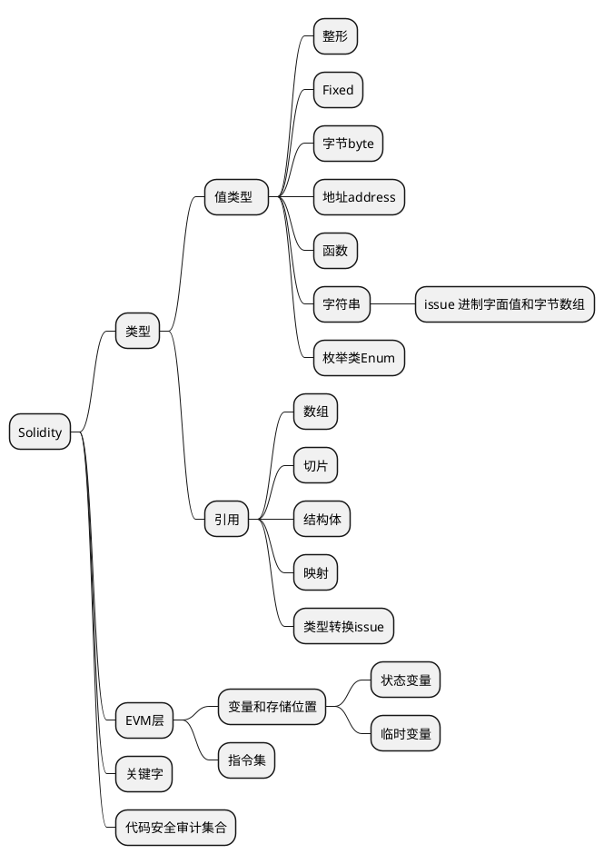

```plantuml
@startmindmap
+ Solidity
++ 类型
+++ 值类型  
++++ 整形
++++ Fixed
++++ 字节byte
++++ 地址address
++++ 函数
++++ 字符串
+++++ issue 进制字面值和字节数组
++++ 枚举类Enum
+++ 引用
++++ 数组
++++ 切片
++++ 结构体
++++ 映射
++++ 类型转换issue

++ EVM层
+++ 变量和存储位置
++++ 状态变量
++++ 临时变量
+++ 指令集

++ 关键字

++ 代码安全审计集合
@endmindmap
```