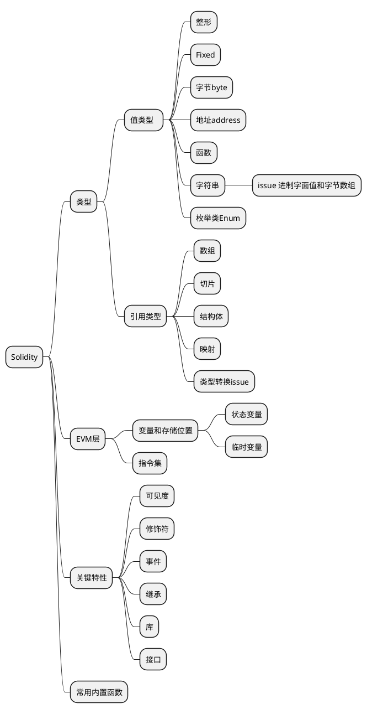
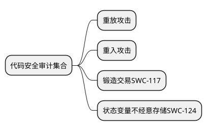

# 阅读概览
solidity笔记整体的内容包含两大部份:

一部分是以太坊中solidity语法的相关内容，另一部分是以太坊中代码安全审计和漏洞101项的一个总结。

完成这两部分的内容学习，基本上可以算是半个以太坊专家算了

## 第一部分 Solidity

```plantuml
@startmindmap
+ Solidity
++ 类型
+++ 值类型  
++++ 整形
++++ Fixed
++++ 字节byte
++++ 地址address
++++ 函数
++++ 字符串
+++++ issue 进制字面值和字节数组
++++ 枚举类Enum
+++ 引用类型
++++ 数组
++++ 切片
++++ 结构体
++++ 映射
++++ 类型转换issue

++ EVM层
+++ 变量和存储位置
++++ 状态变量
++++ 临时变量
+++ 指令集

++ 关键特性
+++ 可见度
+++ 修饰符
+++ 事件
+++ 继承
+++ 库
+++ 接口
++ 常用内置函数

@endmindmap
```

## 第二部分 以太坊安全漏洞

```plantuml
@startmindmap
+ 代码安全审计集合
++ 重放攻击
++ 重入攻击
++ 锻造交易SWC-117
++ 状态变量不经意存储SWC-124
@endmindmap
```